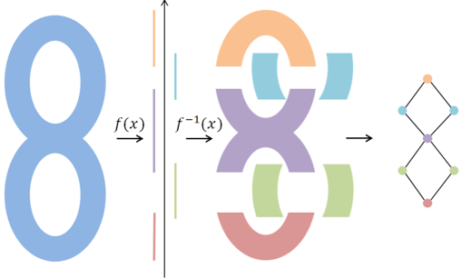
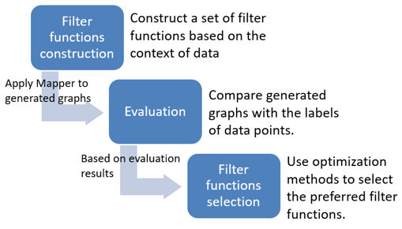
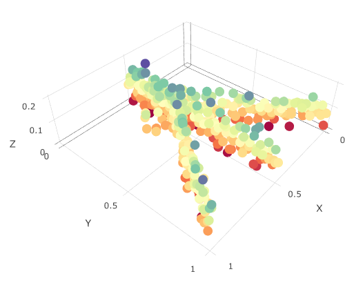
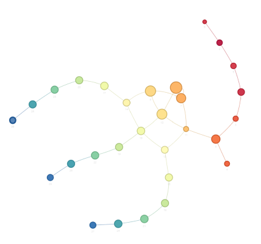

# Introduction

This package aims to provide an easy and flexible framework, semi-supervised topological analysis (STA), to explore the visualization of data based on Mapper, a topological data analysis method, It provides users with extensive tools to customize the visualization, optimally select filter functions and evaluate the results from Mapper.

To install the latest version of this R package directly from github:
```
install.packages("devtools")
devtools::install_github("TianshuFeng/STA")
```

# Resources

- __Detailed instructions__ on how to use this package can be found in the __[vignette](https://tianshufeng.github.io/STA/articles/STA.html)__. 
- The __interactive network analysis Shiny app__ is hosted on [shinyapp.io](http://tsfeng.shinyapps.io/STA-app). 
- The __instruction of the app__ can be found [here](https://tianshufeng.github.io/STA/articles/Shiny_app_instruction.html).

# Usage

The vignette includes example codes to simulate the chicken foot data and to generate the network graph with the STA method. Examples of how to select filter functions and to custom and evaluate the generated networks are also provided.

# Overview of the semi-supervised topological analysis (STA) framework

Topological data analysis (TDA) is a powerful method for reducing data dimensionality, mining underlying data relationships, and intuitively representing the data structure. 
The Mapper algorithm is one such tool that projects high-dimensional data to 1-dimensional space by using a filter function that is subsequently used to reconstruct the data topology relationships. 
The main purpose is to identify local clusters of samples within the dataset and to connect the related clusters to form a network graph that captures topological aspects of the dataset. Therefore, Mapper generally preserves the local distance between samples while distorting large distances, and it summarizes the geometric structure of the data.


|  | 
|:--:| 
| *Schematic of the Mapper Approach. First, f maps each point to a one-dimensional space, which is covered by overlapping intervals. Then, clustering methods are applied to the preimages of intervals for f. Finally, the graph was generated by connecting overlapping clusters.* |


However, domain context information and prior knowledge have not been considered in current TDA modeling frameworks. Here, we report the development and evaluation of a semi-supervised topological analysis (STA) framework that incorporates discrete or continuously labeled data points and selects the most relevant filter functions accordingly. 

Under STA framework, first, we construct a set of filter functions that considers the prior knowledge of the data. Example filter functions are shown in the Appendix. Then, graphs generated with these filter functions are evaluated by using specific measures to compare generated graphs with the prior knowledge of the data. Finally, we use established optimization methods to identify the preferred filter functions and focus on the graphs generated with these filter func-tions for subsequent data analyses. An overview of the STA framework is shown belwo. 

|  | 
|:--:| 
| *Overview of the Semi-supervised Topological Analysis Framework.* |


# Demonstration

Detailed instructions on how to use this package can be found in the [vignette](https://tianshufeng.github.io/STA/articles/STA.html). Here, we provide a quick simulation example, _chicken foot_, to demonstrate the STA package. An overview of the _chichen foot_ data is shown below:

|  | 
|:--:| 
| *Illustration of the _chicken foot_ data* |

Then, we apply the STA method to it:
```
library(STA)
simu_data <- chicken_generator(seed = 1)
simu_data_mapper <- mapper.kmeans(dat = simu_data[,2:4],
                               filter_values = simu_data$Y,
                               num_intervals = 10,
                               percent_overlap = 70)
simple_visNet(simu_data_mapper, filter = simu_data$Y, color_filter = TRUE)
```
The screenshot of the generated networkis is shown below:
|  | 
|:--:| 
| *Screenshot of the network from the STA method.* |


# Reference

Feng, T., Davila, J.I., Liu, Y., Lin, S., Huang, S. and Wang, C., 2019. Semi-supervised Topological Analysis for Elucidating Hidden Structures in High-Dimensional Transcriptome Datasets. _IEEE/ACM transactions on computational biology and bioinformatics._ <[doi:10.1109/TCBB.2019.2950657](https://doi.org/10.1109/TCBB.2019.2950657)>
